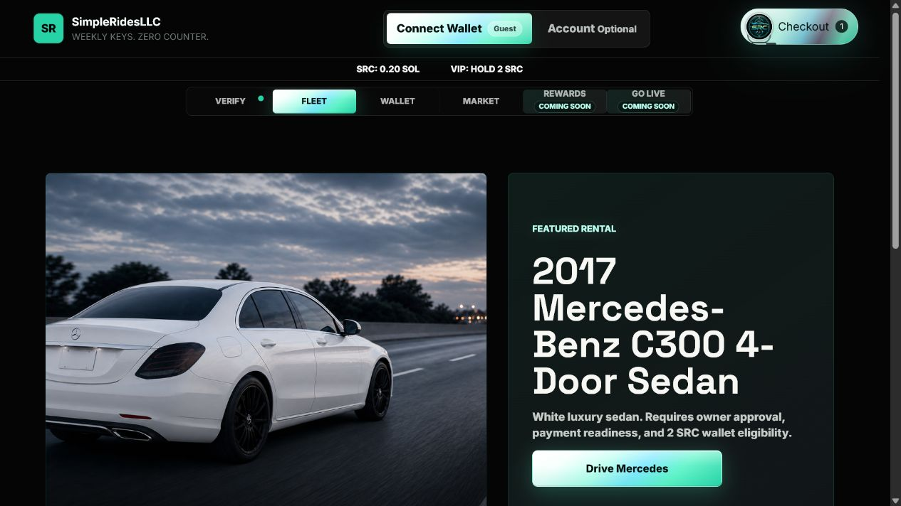
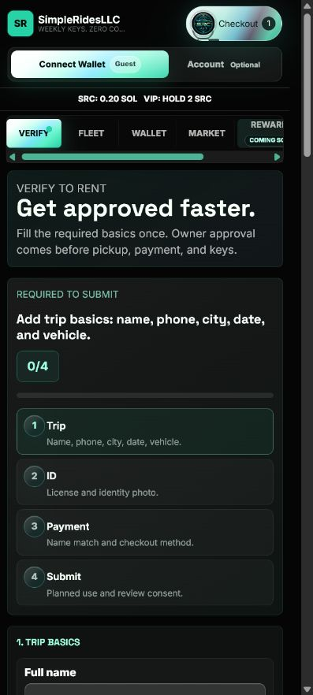
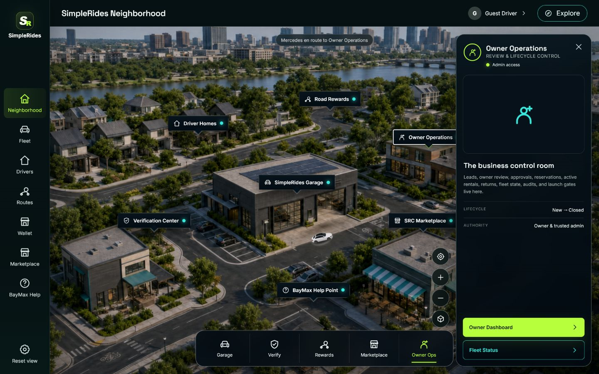
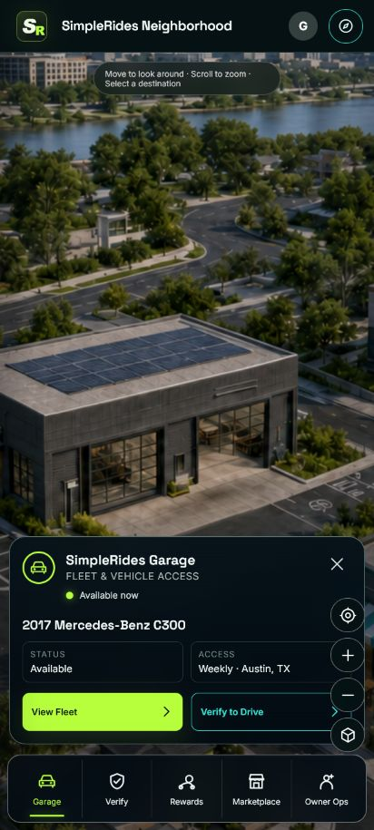
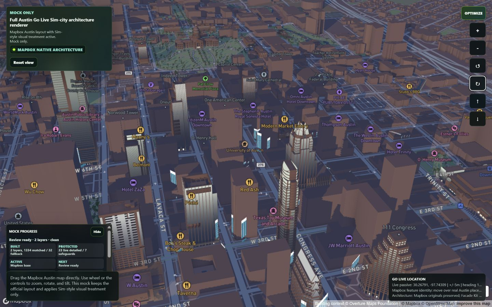

# SimpleRides LLC

An independent mobility-product prototype designed around weekly vehicle access, driver verification, trip support, mileage rewards, and owner operations.

This public repository is a recruiter-friendly showcase. It contains selected front-end and map-architecture work from the larger private application while intentionally excluding credentials, customer information, payment configuration, private business records, and production infrastructure.

## Live domain interface

The customer-facing experience is available at [simpleridesllc.com](https://simpleridesllc.com/). It guides a renter from fleet selection through verification and owner approval, with responsive wallet, marketplace, rewards, and checkout surfaces.



### Mobile verification flow



See [DOMAIN_INTERFACE.md](DOMAIN_INTERFACE.md) for the public customer journey and portfolio scope. Owner sessions, customer records, registrar settings, and production credentials are intentionally excluded.

## Latest interface

The current interface presents the SimpleRides product as an interactive neighborhood. Drivers, fleet access, verification, rewards, marketplace tools, and owner operations become visible destinations instead of disconnected dashboard pages.



### Mobile experience



## New Austin map architecture

The new map prototype uses Mapbox GL JS with native model layers, Austin building context, GPS replay, camera controls, facade-model placement, and explicit performance budgets.



## Product highlights

- Responsive driver and customer experiences
- Interactive neighborhood-style product navigation
- Mapbox-powered Austin map and GPS replay prototype
- Native 3D facade models with multiple levels of detail
- Fleet, verification, rewards, marketplace, and owner-operation flows
- Mobile-conscious interface design with accessible controls

## Technology demonstrated

- Semantic HTML, modern CSS, and JavaScript
- Mapbox GL JS 3D maps
- glTF/GLB facade-model assets and native model layers
- Responsive layouts and SVG interface graphics
- Deterministic GPS replay and live-location filtering
- Performance budgets and visual-regression test design
- Vite development and production builds

## Run locally

```powershell
npm install
Copy-Item .env.example .env
npm run dev
```

Add your own Mapbox public token to `.env` to load the Austin map:

```text
VITE_MAPBOX_TOKEN=your_public_mapbox_token
```

Then explore:

- `https://simpleridesllc.com/` - live customer-facing domain interface
- `http://localhost:5173/` - showcase index
- `http://localhost:5173/demo/` - neighborhood interface
- `http://localhost:5173/map-architecture-mock.html` - Austin map architecture

## Explore the code

- `demo/` contains the responsive neighborhood interface.
- `src/map-architecture/` contains map controls, GPS handling, terrain behavior, facade styling, and performance budgets.
- `assets/map-architecture/` contains the selected facade runtime and 3D model kit.
- `map-architecture-mock.html` is the new map entry point.

## My contribution

I developed the product concept, user flows, interface direction, and working web prototypes, using AI-assisted development tools as part of the implementation workflow. I also designed operational safeguards around verification, privacy, owner approval, location quality, and staged feature rollout.

## Repository scope

This is a curated portfolio copy, not the production repository. Names, screens, and workflows are shown for professional evaluation. No real customer records, private keys, or production tokens are included.

## Resume summary

**SimpleRides LLC - Founder / Product Developer**  
Designed and developed a responsive mobility platform prototype combining vehicle-access workflows, driver verification, route assistance, mileage rewards, owner administration, and a Mapbox-based 3D Austin navigation environment.

## More portfolio work

- [Akina Atelier - cinematic React commerce experience](https://github.com/jwavvydurio/Akina-Atelier)
- [Full GitHub profile](https://github.com/jwavvydurio)

