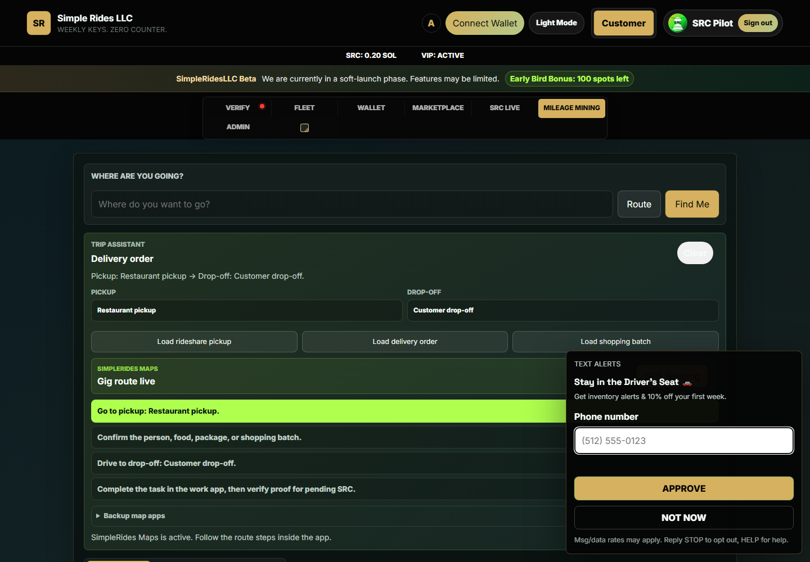
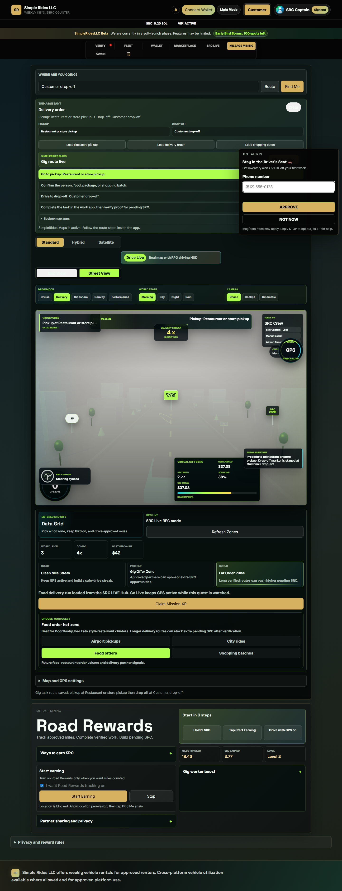

# SimpleRides LLC

An independent mobility-product prototype designed around weekly vehicle access, driver verification, trip support, mileage rewards, and owner operations.

This public repository is a recruiter-friendly showcase. It contains selected front-end work and product visuals from the larger private application while intentionally excluding credentials, customer information, payment configuration, private business records, and production infrastructure.

## Product highlights

- Responsive driver and customer experiences
- Interactive neighborhood-style product navigation
- Route, delivery, rideshare, and mileage-reward concepts
- Fleet, verification, wallet, marketplace, and owner-operation flows
- Mobile-conscious interface design with accessible controls

## Selected interface





## Technology demonstrated

- Semantic HTML
- Modern CSS and responsive layouts
- JavaScript state and interaction design
- SVG interface graphics
- Product prototyping and workflow design
- Vite-based development in the private production workspace

## Explore the code

The `demo` folder contains a selected interactive neighborhood interface. The visual assets it uses are in `assets/neighborhood`.

To view it locally:

```powershell
python -m http.server 8000
```

Then open `http://localhost:8000/demo/`.

## My contribution

I developed the product concept, user flows, interface direction, and working web prototype, using AI-assisted development tools as part of the implementation workflow. I also designed operational safeguards around verification, privacy, owner approval, and staged feature rollout.

## Repository scope

This is a curated portfolio copy, not the production repository. Names, screens, and workflows are shown for professional evaluation. No real customer records or secrets are included.

## Resume summary

**SimpleRides LLC — Founder / Product Developer**  
Designed and developed a responsive mobility platform prototype combining vehicle-access workflows, driver verification, route assistance, mileage rewards, and owner administration.

## More portfolio work

- [Akina Atelier — cinematic React commerce experience](https://github.com/jwavvydurio/Akina-Atelier)
- [Full GitHub profile](https://github.com/jwavvydurio)
